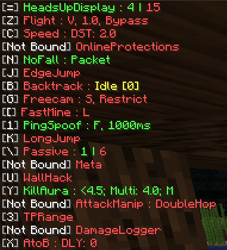
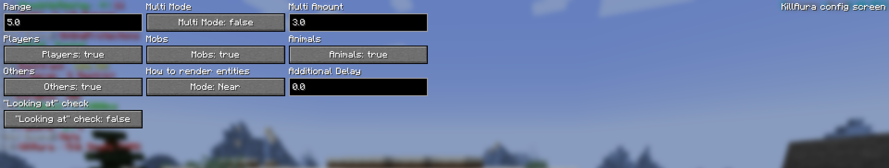

# korppu

### Minecraft cheat client mod

#### You can find a build in `releases/korppu.jar`

- The gui is =
- Press the keybind to toggle the module
- Press rightshift + the keybind to configure a module
- Binds should be in the vanilla minecraft keybind menu

Pretty rough visually and lacking in function right now.
Hud looks like this: 

Config screens look like this:

